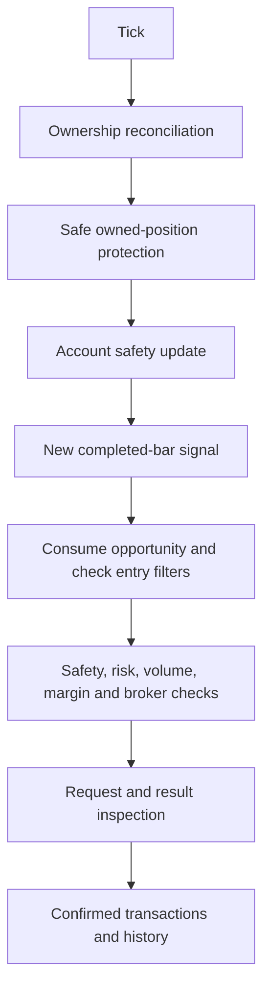

# Architecture of the privately maintained system

This document describes the complete private implementation. Only the components identified as public in the [implementation map](IMPLEMENTATION_MAP.md) are supplied here. There is no public EA entry point or hidden downloadable implementation.

## Lifecycle and flow

OnInit validates configuration and broker/account data, reconstructs confirmed daily entries, recovers account safety, establishes conservative ownership and initializes closed-bar EMAs. The latest completed bar becomes a startup baseline, not a replayed signal.

OnTick reconciles ownership, manages safely owned protection, updates safety, checks a subsequently completed bar, consumes a logical opportunity, applies entry filters, rechecks safety and validates/submits a request. Protection precedes entry-related returns. Submission does not mean confirmation.

OnTradeTransaction observes financial operations and confirmed trade events. Daily count is history-authoritative across symbols using the configured magic; request and transaction paths do not add the same deal twice. OnDeinit cleans up; critical safety persistence occurs during operation rather than relying on shutdown.

## Separate responsibilities

Signal generation identifies an opportunity. Risk sizing estimates monetary loss. Entry filters restrict new exposure; they do not grant netting ownership or override account safety. The private execution controller handles request state and confirmation. Protective management changes only improving, valid, clearly owned stops.

Account safety observes whole-account equity without granting control of other actors' positions. Hedging uses appropriate symbol/magic/position identity. Netting starts from verified flat state and remains controllable only while changes are explained by tracked activity. Ambiguity blocks entries and intentional modification; existing net exposure after restart is unproven.

## Safety and restart

Daily loss uses a daily equity reference. Drawdown uses a retained peak. Locks remain latched through equity recovery; a new broker day does not erase drawdown. Qualifying cash flows require explicit revalidation without silent rebasing. Only one authoritative safety instance per account is supported; distributed coordination is not provided.

The private persistence/recovery implementation validates complete compatible state and reconciles account history before accepting recovery. Missing, corrupt or ambiguous state blocks new entries. Genuine first deployment and later administrative reset are distinct deliberate workflows; ordinary restart invokes neither. Same-day daily lock survives administrative actions. These implementations and detailed storage protocol are not distributed here.

See [testing](TESTING.md) for reported evidence and [limitations](LIMITATIONS.md) for its practical boundaries. The public calculation modules and excerpts demonstrate real source quality; they do not independently prove the complete private system.
